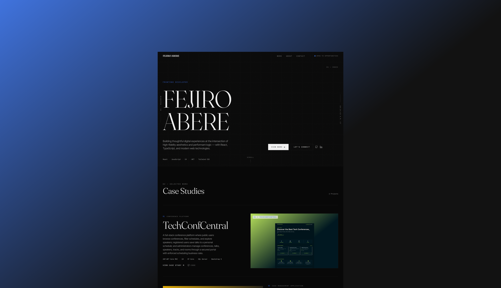
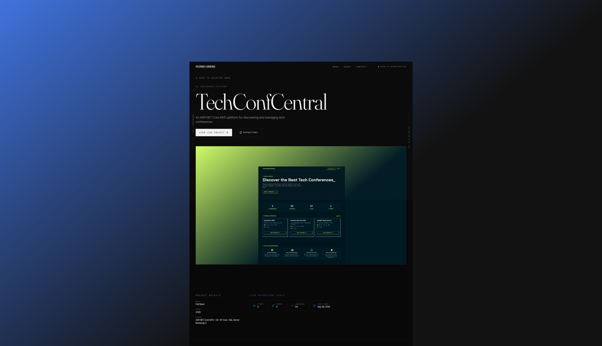

# My Personal Portfolio

A responsive, interactive personal portfolio website built to showcase my journey as a software developer, including my technical skills, featured projects, and notable achievements like my 1st place win at the 2026 Skills Manitoba Web Design & Development Competition.


## Previews

| Homepage | Project Details |
| :---: | :---: |
|  |  |

### Features

- **Dynamic Project Showcase:** Dedicated pages for individual projects detailing the tech stack, features, live demos, and GitHub repository links.
- **Highlight Reel:** An achievements section outlining notable recognitions, such as my Frontend Mentor challenge victories and competitive programming awards.
- **Interactive UI:** Smooth page routing and engaging element animations powered by Framer Motion.
- **Responsive Layout:** A mobile-first design approach using Tailwind CSS to ensure a seamless experience across all device sizes.
- **Professional Profile:** Comprehensive "About Me" and "Skills" sections detailing my background in frontend development and engineering.

## Technologies Used

- **Core:** React, JavaScript
- **Styling & Animation:** Tailwind CSS, Framer Motion
- **Navigation:** React Router
- **Build Tool:** Vite

## How to Install/Run

To get a local copy up and running, follow these simple steps:

1. **Clone the repository**
   ```bash
   git clone [https://github.com/Fejiro001/fejiro-portfolio.git](https://github.com/Fejiro001/fejiro-portfolio.git)

2. **Navigate to the project directory**
   ```bash
   cd your-repo-name

3. **Install dependencies**
   ```bash
   npm install
   
4. **Start the development server**
   ```bash
   npm run dev
   
## Demo
You can view the live demo of my portfolio website [here](https://fejiro-abere.vercel.app/).
